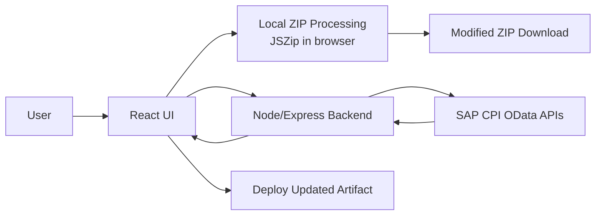
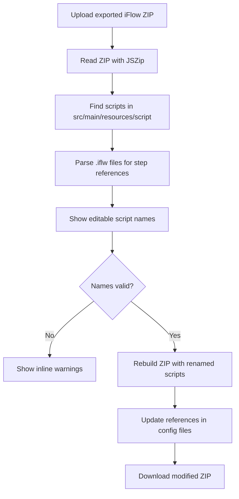
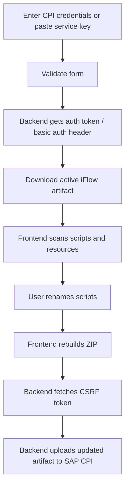
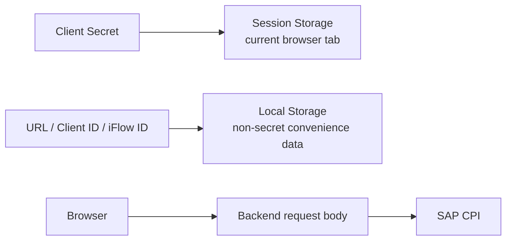

<div align="center">

# SAP CPI Flow Renamer

Rename SAP Cloud Integration iFlow scripts safely, update references automatically, and review unused resources before downloading or deploying the artifact.


</div>

## What This App Does

SAP CPI iFlow exports are ZIP files that can contain Groovy or JavaScript scripts under `src/main/resources/script/`. If a script is renamed manually, references inside `.iflw`, `.xml`, `.prop`, or `.mf` files can break.

This application helps users rename scripts safely:

| Capability | What It Means |
| --- | --- |
| Local ZIP upload | Upload an exported iFlow ZIP, rename scripts, and download a modified ZIP. |
| CPI API mode | Download an active iFlow from SAP CPI, rename scripts, and deploy it back. |
| Reference updates | Updates script references in CPI definition/configuration files. |
| Script validation | Warns for empty names, duplicate names, folder paths, and unsupported extensions. |
| Unused resource review | Shows a separate panel for resources that appear unused in the iFlow. |
| Safer credential handling | Client secrets are not saved in persistent browser local storage. |

## Visual Overview



## User Workflows

### Local ZIP Workflow



### SAP CPI API Workflow



## Application Screens

| Screen | Purpose |
| --- | --- |
| Upload Local ZIP | Drag-and-drop or select an exported CPI ZIP file. |
| Connect to CPI | Enter API URL, token URL, client ID, client secret, and iFlow ID. |
| Script Rename Workspace | Rename discovered `.groovy` and `.js` files with validation warnings. |
| Unused Resources | Review resources that are not referenced by scanned definition files. |
| Notice Dialogs | Show success, warning, and error messages after important actions. |

## Project Structure

```text
.
+-- src/
|   +-- App.tsx          # Main UI, ZIP scanning, validation, rename workflow
|   +-- main.tsx         # React entry point
|   +-- index.css        # Tailwind CSS import
|   +-- lib/
|       +-- utils.ts     # Shared className utility
+-- server.ts            # Express backend and SAP CPI proxy routes
+-- index.html           # HTML entry and browser title
+-- vite.config.ts       # Vite + React + Tailwind configuration
+-- tsconfig.json        # TypeScript settings
+-- package.json         # Scripts and dependencies
+-- package-lock.json    # Dependency lockfile
+-- .env.example         # Example environment variables
+-- metadata.json        # AI Studio metadata
```

## Core Files

| File | Responsibility |
| --- | --- |
| `src/App.tsx` | Main product experience, API form validation, script validation, ZIP parsing, rename logic, unused resource display, dialogs. |
| `server.ts` | Health check, CPI download proxy, CPI upload proxy, OAuth/basic auth handling, production static serving. |
| `vite.config.ts` | React, Tailwind, environment variable, and alias setup. |
| `package.json` | Development, build, start, and type-check commands. |

## Backend API

### Health Check

```http
GET /api/health
```

Returns:

```json
{
  "success": true,
  "message": "Node.js Backend is running."
}
```

### Download iFlow From SAP CPI

```http
POST /api/cpi/download
```

Request body:

```json
{
  "cpiUrl": "https://example.hana.ondemand.com/api/v1",
  "tokenUrl": "https://example.authentication.hana.ondemand.com/oauth/token",
  "username": "client-id",
  "password": "client-secret",
  "iflowId": "ExampleIFlow"
}
```

The backend calls:

```text
/IntegrationDesigntimeArtifacts(Id='{iflowId}',Version='active')/$value
```

### Upload Updated iFlow To SAP CPI

```http
PUT /api/cpi/upload
```

Request body:

```json
{
  "cpiUrl": "https://example.hana.ondemand.com/api/v1",
  "tokenUrl": "https://example.authentication.hana.ondemand.com/oauth/token",
  "username": "client-id",
  "password": "client-secret",
  "iflowId": "ExampleIFlow",
  "zipData": "base64-encoded-zip-content"
}
```

The backend authenticates with SAP CPI, fetches a CSRF token, and uploads the updated artifact content.

## Validation Rules

### CPI Form

| Field | Rule |
| --- | --- |
| API URL | Required and must be HTTPS. |
| Token URL | Optional, but if provided must be HTTPS. |
| Client ID | Required. |
| Client Secret | Required for CPI API access. |
| iFlow ID | Required. |

### Script Names

| Rule | Reason |
| --- | --- |
| Cannot be empty | Prevents broken ZIP paths and references. |
| Cannot contain `/` or `\` | Rename should change file name only, not folder structure. |
| Must end in `.groovy` or `.js` | Keeps CPI script resource type clear. |
| Cannot duplicate another new name | Prevents conflicting script files in the generated artifact. |

## Security Notes



- The client secret is not stored in persistent `localStorage`.
- Non-sensitive connection fields may be remembered for convenience.
- Credentials are sent to the backend only when CPI API actions are used.
- The backend currently acts as a CPI proxy, so production hosting should add app authentication, rate limiting, domain allowlists, and stricter outbound URL validation.

## Local Development

### Prerequisites

- Node.js
- npm

### Install

```bash
npm ci
```

### Run

```bash
npm run dev
```

The app runs at:

```text
http://localhost:3000
```

### Type Check

```bash
npm run lint
```

### Build

```bash
npm run build
```

### Start Built App

```bash
npm start
```

## Command Reference

| Command | Description |
| --- | --- |
| `npm ci` | Install locked dependencies. |
| `npm run dev` | Build and run the ready-to-use local server. |
| `npm run lint` | Run TypeScript checks with `tsc --noEmit`. |
| `npm run build` | Build frontend and bundle the Node server as ESM. |
| `npm start` | Start the built server from `dist/server.mjs`. |

## Production Readiness Checklist

- Add authentication before exposing CPI API mode publicly.
- Restrict `cpiUrl` and `tokenUrl` to trusted SAP/BTP domains.
- Block localhost/private-network outbound requests from the backend.
- Add rate limiting and request size controls.
- Add audit logs for deploy actions, without logging secrets.
- Add automated tests for ZIP parsing, rename validation, and reference replacement.

## Roadmap Ideas

- Add a preview diff before downloading or deploying.
- Add an option to export unused-resource analysis as CSV.
- Split `src/App.tsx` into smaller components and ZIP utility modules.
- Add unit tests for script/resource scanning.
- Add deployment profiles for internal company hosting.
